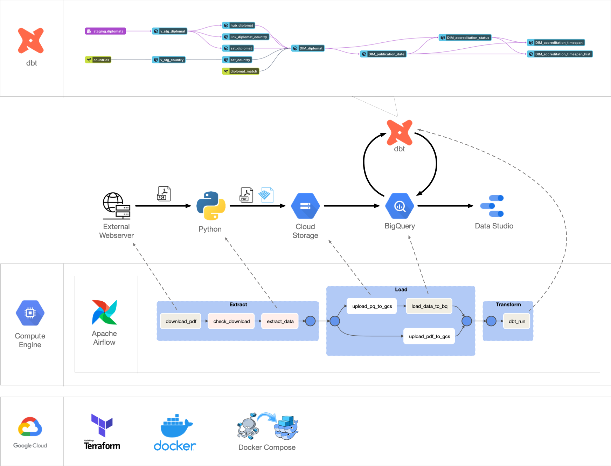
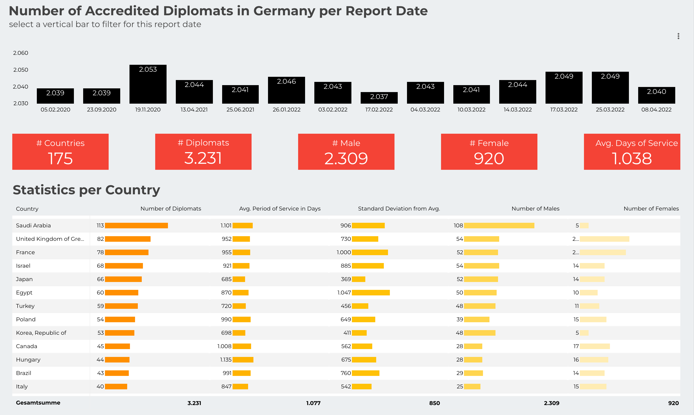

# Diplomats in Germany

The German ministry of foreign affairs (Auswärtiges Amt) regularly updates a list of all foreign diplomatic missions (embassies) and their diplomats, which the Federal Republic of Germany accredits.

The list in PDF format could be retrieved from the following [website](https://www.auswaertiges-amt.de/de/ReiseUndSicherheit/diplomatische-vertretungen-in-deutschland/199678?openAccordionId=item-199682-0-panel). Click on *"Diplomatische und andere Vertretungen in der Bundesrepublik Deutschland"* to download the newest version of the PDF file.

## Problem
It is difficult to study changes in the list over time, mainly because of two reasons:
- Previous versions of the list are not made available, even if you have saved the specific link to the respective PDF file. Therefore the files needed to be downloaded regularly.
- Even if you have downloaded multiple versions, it is hard to compare the data in the PDF format and, therefore, it needs to be extracted for easier comparison.
[Have a look at the PDF](https://www.auswaertiges-amt.de/blob/199684/c35dae946fa87b4e98973889e1aaf791/vertretungenfremderstaatendl-data.pdf) for a better understanding.

## Motivation
This project could help overcome the mentioned problems by regularly checking if a new version of the PDF report was published. The data is extracted and saved in a database for each new version of the PDF report. A raw data vault DWH model is used to track changes between the versions.

This data model could help answer questions such as:
- How many diplomats were accredited in Germany at a given time?
- What is the average time diplomats spend at a diplomatic mission in Germany?
- What is the gender ratio for a specific diplomatic mission?

## Infrastructure

The following tools and technologies are used:

- Cloud - [**Google Cloud Platform**](https://cloud.google.com)
- Infrastructure as Code software - [**Terraform**](https://www.terraform.io)
- Containerization - [**Docker**](https://www.docker.com), [**Docker Compose**](https://docs.docker.com/compose/)
- Batch Processing - [**Python**](https://www.python.org)
- Orchestration - [**Airflow**](https://airflow.apache.org)
- Transformation - [**dbt**](https://www.getdbt.com)
- Data Lake - [**Google Cloud Storage**](https://cloud.google.com/storage)
- Data Warehouse - [**BigQuery**](https://cloud.google.com/bigquery)
- Data Visualization - [**Data Studio**](https://datastudio.google.com/overview)



## Dashboard

Link to the dashboard: 
https://datastudio.google.com/reporting/c67883ee-7b3a-481f-a28f-e001b0c3c743


[](https://datastudio.google.com/reporting/c67883ee-7b3a-481f-a28f-e001b0c3c743)


## Run the Walkthrough Tutorial

**Pre-Requisite:** Create a free [GCP account](https://console.cloud.google.com/freetrial) if you do not have one. Note that GCP also offers [$300 free credits for 90 days](https://cloud.google.com/free/docs/gcp-free-tier/#free-trial).

You can follow these interactive instructions as a guide through the setup process.

[](https://console.cloud.google.com/cloudshell/editor?cloudshell_git_repo=https://github.com/LoHertel/diplomats-in-germany&cloudshell_tutorial=project-walkthrough.md)

After clicking the button *Open in Google Cloud Shell*, the Google Cloud Shell Editor will open and ask for your authorization to clone this repository. The interactive walkthrough for the project opens on the right side of the Cloud Shell Editor.
*Note: There might be an error message showing that third-party cookies are needed. You can allow third-party cookies for the Cloud Shell Editor. See [here for more information](https://cloud.google.com/code/docs/shell/limitations#private_browsing_and_disabled_third-party_cookies).*

> ***Note:** If you have closed the walkthrough and want to reopen it, run the following command in the cloudshell terminal window:*
> ```sh
> cd ~/cloudshell_open/diplomats-in-germany && cloudshell launch-tutorial project-walkthrough.md
> ```

If you don't want to use Cloud Shell Editor, you could go through the instructions manually: [Open Instructions](project-walkthrough.md)

## Further Improvement
* Setup
    * create a shell script for VM setup and integrate it in Terraform (also make [SSH key creation](https://cloud.google.com/compute/docs/connect/create-ssh-keys#create_an_ssh_key_pair) more robust or use Google service account auth method to connect to VM)
    * create a project-specific IAM role for Terraform and assign it to the service * account instead of granting the permissions directly
    * limit permissions to the minimal necessary set
    * create an additional service account for running the data pipeline (currently, the Terraform user with a lot of permissions is used)
    * integrate Cloud Build for CI / CD
* Airflow
    * create a DAG for the initial load of the old PDF reports
    * find out why XCOM doesn't work with task groups in Airflow
    * use Cloud Composer instead of Compute Engine VM
* dbt
    * add business data vault 
* Data Studio
    * remove calculated fields from Data Studio report and precalculate this data in the datamart (otherwise we can not use the report as template and change the data sources)
    * compare differences between two report dates
* spell checking


## Special Mentions
I'd like to thank the [DataTalks.Club](https://datatalks.club) for offering this Data Engineering course completely free. If you want to upskill on Data Engineering technologies, please check out their self-paced [course](https://github.com/DataTalksClub/data-engineering-zoomcamp). :)